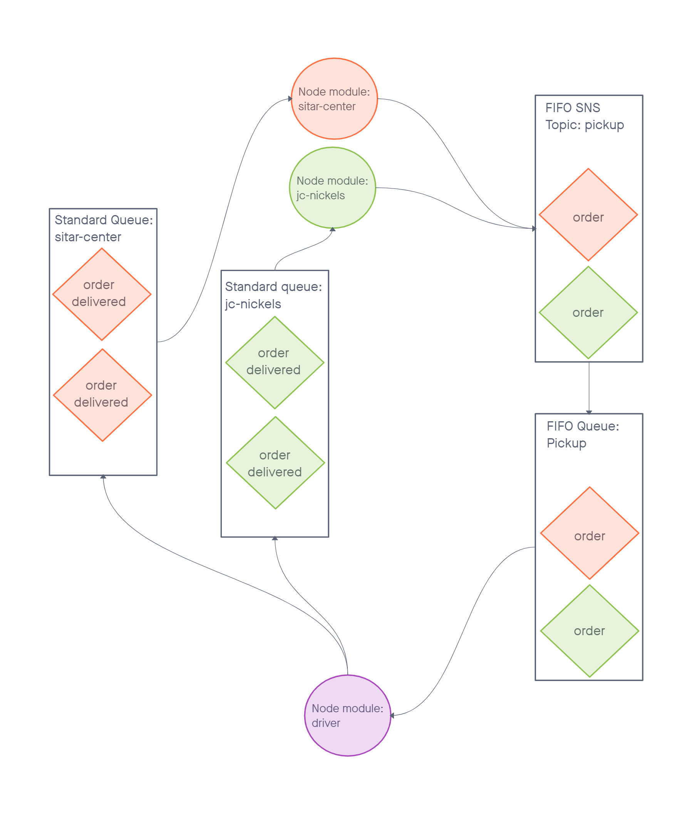
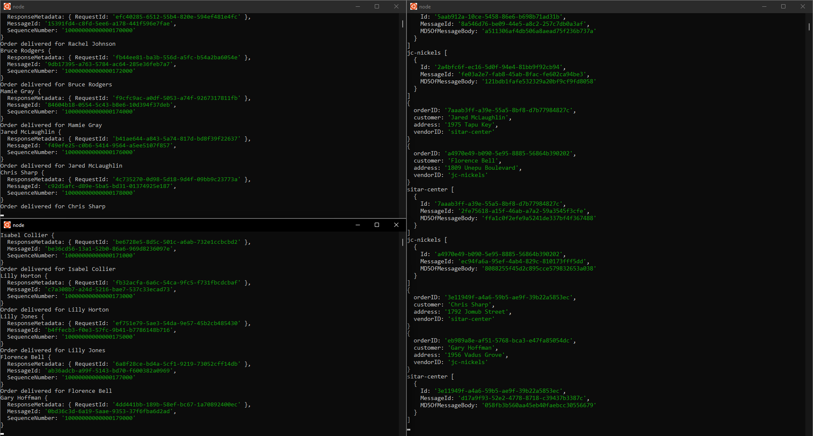

# caps-cloud

This project contains two node modules that work together with AWS SNS and SQS services to simulate a delivery notification system for vendors and drivers.

## Setup

Run `npm install` and create a `.env` in both the vendor and driver folders. 

### driver/.env

```.env
SQS_URL=<FIFO SQS URL>
```

### vendor/.env

```.env
SNS_ARN=<SNS ARN>
SQS_URL=<Standard SQS URL>
```

## Run

Run `node sitar-center.js` and `node js-nickels`  to begin the vendor clients and `node driver.js` to begin te driver client.

## UML



## Demo Screenshot


